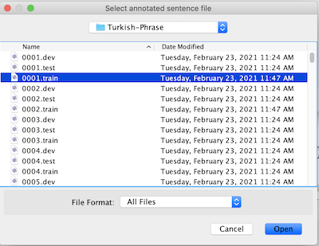
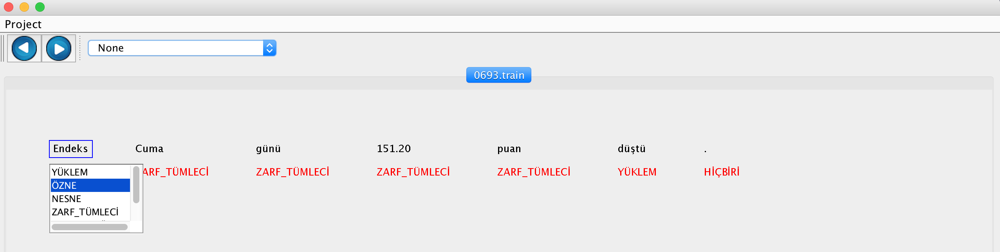

# Shallow Parsing

## Task Definition

Many language processing tasks do not require complex parse trees. Instead, a partial parse, or a shallow parse of a sentence is sufficient. Shallow parsing is the process of identifying flat non-overlapping parts of a sentence. These parts typically include Özne, Yüklem, Nesne, Zarf Tümleci, and Dolaylı Tümleç. Since a parsed text does not include a hierarchical structure, a bracketing notation is sufficient to denote the location and the type of shallow parse chunks in a sentence. 

In shallow parsing, one tries to find the strings of text that belong to a chunk and to classify the type of that chunk. Standard approach for shallow parsing is a word-by-word classification, where the classifier is trained to label the words in the text with tags that indicate the presence of particular chunks. After giving the class labels to our training data chunk labels, the next step is to select a group of features to discriminate different chunks for each input word.

[<sub>OZNE</sub> Türk Hava Yolları] [<sub>ZARF TÜMLECİ</sub> Salı günü] [<sub>NESNE</sub> yeni indirimli fiyatlarını] [<sub>YÜKLEM</sub> açıkladı]

[<sub>SUBJECT</sub> Turkish Airlines] [<sub>PREDICATE</sub> announced] [<sub>OBJECT</sub> new discounted fares] [<sub>ADVERBIAL CLAUSE</sub> on Tuesday]  

The Table below shows typical shallow parse tags and the questions asked to the predicate to identify the chunks for those tags.
 
|Tag|Question|
|---|---|
|ÖZNE|Who, What|
|ZARF TÜMLECİ|When, How, Why|
|DOLAYLI TÜMLEÇ|Where, To/From whom|
|NESNE|What, Whom|
|YÜKLEM|Predicate|

## Data Annotation

### Preparation

1. Collect a set of sentences to annotate. 
2. Each sentence in the collection must be named as xxxx.yyyyy in increasing order. For example, the first sentence to be annotated will be 0001.train, the second 0002.train, etc.
3. Put the sentences in the same folder such as *Turkish-Phrase*.
4. Build the project and put the generated sentence-shallowparse.jar file into another folder such as *Program*.
5. Put *Turkish-Phrase* and *Program* folders into a parent folder.


### Annotation

1. Open sentence-shallowparse.jar file.
2. Wait until the data load message is displayed.
3. Click Open button in the Project menu.

4. Choose a file for annotation from the folder *Turkish-Phrase*.  

5. For each word in the sentence, click the word, and annotate the word with one of the ÖZNE, NESNE, DOLAYLI_TÜMLEÇ, ZARF_TÜMLECİ, YÜKLEM, NONE tags.

6. Click one of the next buttons to go to other files.

## Classification DataSet Generation

After annotating sentences, you can use [DataGenerator](https://github.com/starlangsoftware/DataGenerator) package to generate classification dataset for the Shallow Parsing task.

## Generation of ML Models

After generating the classification dataset as above, one can use the [Classification](https://github.com/starlangsoftware/Classification) package to generate machine learning models for the Shallow Parsing task.

Annotated Datasets
============
[Tourism, Penn-Treebank](http://104.247.163.162/nlptoolkit/turkish-shallowparse1.html)

For Developers
============

## Requirements

* [Java Development Kit 8 or higher](#java), Open JDK or Oracle JDK
* [Maven](#maven)
* [Git](#git)

### Java 

To check if you have a compatible version of Java installed, use the following command:

    java -version
    
If you don't have a compatible version, you can download either [Oracle JDK](https://www.oracle.com/technetwork/java/javase/downloads/jdk8-downloads-2133151.html) or [OpenJDK](https://openjdk.java.net/install/)    

### Maven
To check if you have Maven installed, use the following command:

    mvn --version
    
To install Maven, you can follow the instructions [here](https://maven.apache.org/install.html).      

### Git

Install the [latest version of Git](https://git-scm.com/book/en/v2/Getting-Started-Installing-Git).

## Download Code

In order to work on code, create a fork from GitHub page. 
Use Git for cloning the code to your local or below line for Ubuntu:

	git clone <your-fork-git-link>

A directory called ShallowParsing will be created. Or you can use below link for exploring the code:

	git clone https://github.com/olcaytaner/ShallowParsing.git

## Open project with IntelliJ IDEA

Steps for opening the cloned project:

* Start IDE
* Select **File | Open** from main menu
* Choose `ShallowParsing/pom.xml` file
* Select open as project option
* Couple of seconds, dependencies with Maven will be downloaded. 


## Compile

**From IDE**

After being done with the downloading and Maven indexing, select **Build Project** option from **Build** menu. After compilation process, user can run ShallowParsing.

**From Console**

Go to `ShallowParsing` directory and compile with 

     mvn compile 

## Generating jar files

**From IDE**

Use `package` of 'Lifecycle' from maven window on the right and from `ShallowParsing` root module.

**From Console**

Use below line to generate jar file:

     mvn install

## Maven Usage

        <dependency>
            <groupId>io.github.starlangsoftware</groupId>
            <artifactId>ShallowParsing</artifactId>
            <version>1.0.1</version>
        </dependency>

For Contibutors
============

### pom.xml file
1. Standard setup for packaging is similar to:
```
    <groupId>io.github.starlangsoftware</groupId>
    <artifactId>Amr</artifactId>
    <version>1.0.0</version>
    <packaging>jar</packaging>
    <name>NlpToolkit.Amr</name>
    <description>Abstract Meaning Representation Library</description>
    <url>https://github.com/StarlangSoftware/Amr</url>

    <organization>
        <name>io.github.starlangsoftware</name>
        <url>https://github.com/starlangsoftware</url>
    </organization>

    <licenses>
        <license>
            <name>The Apache Software License, Version 2.0</name>
            <url>http://www.apache.org/licenses/LICENSE-2.0.txt</url>
        </license>
    </licenses>

    <developers>
        <developer>
            <name>Olcay Taner Yildiz</name>
            <email>olcay.yildiz@ozyegin.edu.tr</email>
            <organization>Starlang Software</organization>
            <organizationUrl>http://www.starlangyazilim.com</organizationUrl>
        </developer>
    </developers>

    <scm>
        <connection>scm:git:git://github.com/starlangsoftware/amr.git</connection>
        <developerConnection>scm:git:ssh://github.com:starlangsoftware/amr.git</developerConnection>
        <url>http://github.com/starlangsoftware/amr/tree/master</url>
    </scm>

    <properties>
        <maven.compiler.source>1.8</maven.compiler.source>
        <maven.compiler.target>1.8</maven.compiler.target>
        <project.build.sourceEncoding>UTF-8</project.build.sourceEncoding>
    </properties>
```
2. Only top level dependencies should be added. Do not forget junit dependency.
```
    <dependencies>
        <dependency>
            <groupId>io.github.starlangsoftware</groupId>
            <artifactId>AnnotatedSentence</artifactId>
            <version>1.0.78</version>
        </dependency>
        <dependency>
            <groupId>junit</groupId>
            <artifactId>junit</artifactId>
            <version>4.13.1</version>
            <scope>test</scope>
        </dependency>
    </dependencies>
```
3. Maven compiler, gpg, source, javadoc plugings should be added.
```
	<plugin>
		<groupId>org.apache.maven.plugins</groupId>
		<artifactId>maven-compiler-plugin</artifactId>
		<version>3.6.1</version>
		<configuration>
			<source>1.8</source>
			<target>1.8</target>
		</configuration>
	</plugin>
	<plugin>
		<groupId>org.apache.maven.plugins</groupId>
		<artifactId>maven-gpg-plugin</artifactId>
		<version>1.6</version>
		<executions>
			<execution>
				<id>sign-artifacts</id>
				<phase>verify</phase>
				<goals>
					<goal>sign</goal>
				</goals>
			</execution>
		</executions>
	</plugin>
	<plugin>
		<groupId>org.apache.maven.plugins</groupId>
		<artifactId>maven-source-plugin</artifactId>
		<version>2.2.1</version>
		<executions>
			<execution>
				<id>attach-sources</id>
				<goals>
					<goal>jar-no-fork</goal>
				</goals>
			</execution>
		</executions>
	</plugin>
	<plugin>
		<groupId>org.apache.maven.plugins</groupId>
		<artifactId>maven-javadoc-plugin</artifactId>
		<configuration>
			<source>8</source>
		</configuration>
		<version>3.10.0</version>
		<executions>
			<execution>
				<id>attach-javadocs</id>
				<goals>
					<goal>jar</goal>
				</goals>
			</execution>
		</executions>
	</plugin>
```
4. Currently publishing plugin is Sonatype.
```
	<plugin>
		<groupId>org.sonatype.central</groupId>
		<artifactId>central-publishing-maven-plugin</artifactId>
		<version>0.8.0</version>
		<extensions>true</extensions>
		<configuration>
			<publishingServerId>central</publishingServerId>
			<autoPublish>true</autoPublish>
		</configuration>
	</plugin>
```
5. For UI jar files use assembly plugins.
```
	<plugin>
		<groupId>org.apache.maven.plugins</groupId>
		<artifactId>maven-assembly-plugin</artifactId>
		<version>2.2-beta-5</version>
		<executions>
			<execution>
				<id>sentence-dependency</id>
				<phase>package</phase>
				<goals>
					<goal>single</goal>
				</goals>
				<configuration>
					<archive>
						<manifest>
							<mainClass>Amr.Annotation.TestAmrFrame</mainClass>
						</manifest>
					</archive>
					<finalName>amr</finalName>
				</configuration>
			</execution>
		</executions>
		<configuration>
			<descriptorRefs>
				<descriptorRef>jar-with-dependencies</descriptorRef>
			</descriptorRefs>
			<appendAssemblyId>false</appendAssemblyId>
		</configuration>
	</plugin>
```
### Resources
1. Add resources to the resources subdirectory. These will include image files (necessary for UI), data files, etc.
   
### Java files
1. Do not forget to comment each function.
```
    /**
     * Returns the value of a given layer.
     * @param viewLayerType Layer for which the value questioned.
     * @return The value of the given layer.
     */
    public String getLayerInfo(ViewLayerType viewLayerType){
```
2. Function names should follow caml case.
```
    public MorphologicalParse getParse()
```
3. Write toString methods, if necessary.
4. Use Junit for writing test classes. Use test setup if necessary.
```
public class AnnotatedSentenceTest {
    AnnotatedSentence sentence0, sentence1, sentence2, sentence3, sentence4;
    AnnotatedSentence sentence5, sentence6, sentence7, sentence8, sentence9;

    @Before
    public void setUp() throws Exception {
        sentence0 = new AnnotatedSentence(new File("sentences/0000.dev"));
```
